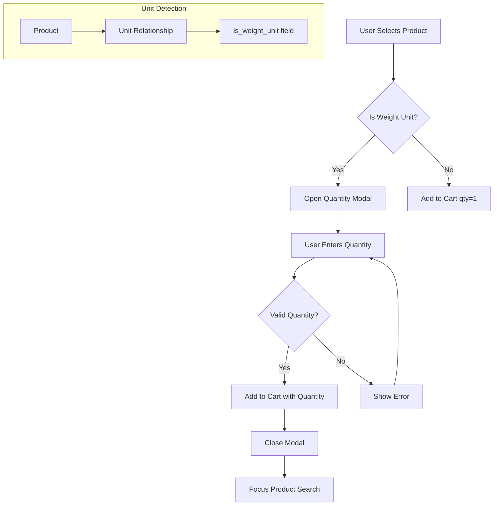

# Design Document: Weight Quantity Modal

## Overview

This feature adds an automatic quantity input modal to the MikPOS Point of Sale system for weight-based products. When a cashier selects a product that uses a weight unit (KG, LB, GR, etc.), a modal appears allowing them to enter the exact quantity before adding to cart. This improves efficiency for businesses selling products by weight, such as fruver stores.

The implementation requires:
1. Database schema change to identify weight-based units
2. Modification to the POS component to detect weight units and show the modal
3. A new modal UI component for quantity entry
4. Validation logic for quantity input

## Architecture



## Components and Interfaces

### Database Changes

#### Migration: Add `is_weight_unit` to Units Table

```php
Schema::table('units', function (Blueprint $table) {
    $table->boolean('is_weight_unit')->default(false)->after('abbreviation');
});
```

### Model Changes

#### Unit Model

Add the `is_weight_unit` field to fillable and casts:

```php
// app/Models/Unit.php
protected $fillable = ['name', 'abbreviation', 'is_active', 'is_weight_unit'];

protected function casts(): array
{
    return [
        'is_active' => 'boolean',
        'is_weight_unit' => 'boolean',
    ];
}

/**
 * Check if this unit is a weight-based unit.
 */
public function isWeightUnit(): bool
{
    return $this->is_weight_unit;
}
```

### Livewire Component Changes

#### PointOfSale Component

New properties:
```php
// Weight quantity modal
public $showWeightModal = false;
public $weightModalProduct = null;
public $weightModalQuantity = '';
```

New methods:
```php
/**
 * Check if a product uses a weight-based unit.
 */
protected function isWeightBasedProduct($product): bool
{
    return $product->unit && $product->unit->is_weight_unit;
}

/**
 * Open the weight quantity modal for a product.
 */
public function openWeightModal($productId, $childId = null): void
{
    // Load product with unit relationship
    // Set modal data
    // Show modal
}

/**
 * Confirm the weight quantity and add to cart.
 */
public function confirmWeightModal(): void
{
    // Validate quantity
    // Add to cart with specified quantity
    // Close modal
}

/**
 * Close the weight modal without adding to cart.
 */
public function closeWeightModal(): void
{
    // Reset modal state
    // Return focus to search
}
```

Modified `addToCart` method:
```php
public function addToCart($productId, $childId = null)
{
    $product = Product::with(['tax', 'unit', 'children'])->find($productId);
    
    if (!$product) return;
    
    // Check if weight-based product
    if ($this->isWeightBasedProduct($product)) {
        $this->openWeightModal($productId, $childId);
        return;
    }
    
    // Existing logic for non-weight products...
}
```

### View Changes

#### Weight Quantity Modal Component

The modal will be added to `point-of-sale.blade.php`:

```blade
@if($showWeightModal && $weightModalProduct)
<div class="relative z-[100]" role="dialog" aria-modal="true"
    x-data="{ quantity: @entangle('weightModalQuantity') }"
    @keydown.escape.window="$wire.closeWeightModal()"
    @keydown.enter.window="$wire.confirmWeightModal()">
    <!-- Backdrop -->
    <div class="fixed inset-0 bg-slate-900/75 backdrop-blur-sm z-[100]" 
        wire:click="closeWeightModal"></div>
    
    <!-- Modal -->
    <div class="fixed inset-0 z-[101] overflow-y-auto">
        <div class="flex min-h-full items-center justify-center p-4">
            <div class="relative w-full max-w-sm bg-white rounded-2xl shadow-xl">
                <!-- Header -->
                <div class="px-6 py-4 border-b border-slate-200">
                    <h3 class="text-lg font-bold text-slate-900 text-center">
                        Ingresar Cantidad
                    </h3>
                </div>
                
                <!-- Content -->
                <div class="px-6 py-6 space-y-4">
                    <!-- Product Info -->
                    <div class="text-center">
                        <p class="font-medium text-slate-800">
                            {{ $weightModalProduct['name'] }}
                        </p>
                        <p class="text-sm text-slate-500">
                            ${{ number_format($weightModalProduct['price'], 2) }} / 
                            {{ $weightModalProduct['unit'] }}
                        </p>
                    </div>
                    
                    <!-- Quantity Input -->
                    <div>
                        <input type="number" 
                            wire:model="weightModalQuantity"
                            x-ref="weightInput"
                            x-init="$nextTick(() => $refs.weightInput.focus())"
                            step="0.001"
                            min="0.001"
                            class="w-full text-center text-3xl font-bold px-4 py-4 
                                border border-slate-300 rounded-xl 
                                focus:ring-2 focus:ring-[#ff7261]/50 focus:border-[#ff7261]"
                            placeholder="0.000">
                        <p class="text-center text-lg text-slate-600 mt-2">
                            {{ $weightModalProduct['unit'] }}
                        </p>
                    </div>
                    
                    <!-- Stock Info -->
                    <p class="text-center text-sm text-slate-500">
                        Stock disponible: 
                        {{ number_format($weightModalProduct['stock'], 3) }} 
                        {{ $weightModalProduct['unit'] }}
                    </p>
                </div>
                
                <!-- Footer -->
                <div class="px-6 py-4 bg-slate-50 border-t border-slate-200 
                    flex justify-center gap-3">
                    <button wire:click="closeWeightModal" 
                        class="px-6 py-2.5 text-sm font-medium text-slate-700 
                            bg-white border border-slate-300 rounded-xl 
                            hover:bg-slate-50">
                        Cancelar
                    </button>
                    <button wire:click="confirmWeightModal" 
                        class="px-6 py-2.5 text-sm font-medium text-white 
                            bg-gradient-to-r from-[#ff7261] to-[#a855f7] 
                            rounded-xl hover:from-[#e55a4a] hover:to-[#9333ea]">
                        Agregar
                    </button>
                </div>
            </div>
        </div>
    </div>
</div>
@endif
```

## Data Models

### Unit Model (Updated)

| Field | Type | Description |
|-------|------|-------------|
| id | bigint | Primary key |
| name | string | Unit name (e.g., "Kilogramo") |
| abbreviation | string(10) | Short form (e.g., "KG") |
| is_weight_unit | boolean | Whether this is a weight-based unit |
| is_active | boolean | Whether the unit is active |
| timestamps | datetime | Created/updated timestamps |

### Weight Modal Product Data Structure

```php
$weightModalProduct = [
    'product_id' => int,      // Product ID
    'child_id' => ?int,       // Product child ID (if variant)
    'name' => string,         // Display name
    'price' => float,         // Unit price (with tax)
    'unit' => string,         // Unit abbreviation
    'stock' => float,         // Available stock
    'image' => ?string,       // Product image path
];
```

## Correctness Properties

*A property is a characteristic or behavior that should hold true across all valid executions of a system—essentially, a formal statement about what the system should do. Properties serve as the bridge between human-readable specifications and machine-verifiable correctness guarantees.*

### Property 1: Unit Default Value

*For any* newly created Unit without specifying `is_weight_unit`, the field SHALL default to `false`.

**Validates: Requirements 1.2**

### Property 2: Weight Unit Detection Determines Modal Behavior

*For any* product with a unit where `is_weight_unit` is true, selecting that product SHALL trigger the quantity modal. Conversely, *for any* product with a unit where `is_weight_unit` is false (or no unit), selecting that product SHALL add directly to cart with quantity 1.

**Validates: Requirements 2.1, 5.1, 6.1**

### Property 3: Modal Data Completeness

*For any* product that triggers the weight quantity modal, the modal data SHALL contain: product name, unit price, unit abbreviation, and available stock.

**Validates: Requirements 2.3, 2.4, 2.5, 2.6**

### Property 4: Decimal Input Handling

*For any* numeric input with decimal point or comma, the system SHALL correctly parse it as a decimal value. *For any* value with more than 3 decimal places, the system SHALL round to 3 decimal places.

**Validates: Requirements 3.1, 3.4**

### Property 5: Non-Positive Quantity Rejection

*For any* quantity value less than or equal to zero, the system SHALL reject the input and prevent adding to cart.

**Validates: Requirements 3.2**

### Property 6: Stock Limit Validation

*For any* quantity value exceeding the available stock, the system SHALL reject the input and prevent adding to cart.

**Validates: Requirements 3.3**

### Property 7: Cart Addition with Specified Quantity

*For any* valid quantity entered in the weight modal, confirming the modal SHALL add the product to cart with exactly that quantity (rounded to 3 decimal places).

**Validates: Requirements 4.4**

## Error Handling

### Validation Errors

| Error Condition | User Message | Behavior |
|-----------------|--------------|----------|
| Quantity <= 0 | "La cantidad debe ser mayor a cero" | Keep modal open, highlight input |
| Quantity > stock | "Stock insuficiente. Disponible: X.XXX" | Keep modal open, highlight input |
| Invalid input | "Ingresa una cantidad válida" | Keep modal open, clear input |

### Edge Cases

1. **Product without unit**: Treat as non-weight product, add directly to cart
2. **Unit without is_weight_unit field**: Default to false (non-weight)
3. **Zero stock**: Show modal but prevent any quantity entry
4. **Modal already open**: Ignore new product selection until modal is closed

## Testing Strategy

### Unit Tests

Unit tests should cover specific examples and edge cases:

1. **Unit Model Tests**
   - Test `is_weight_unit` field exists and is boolean
   - Test default value is false
   - Test `isWeightUnit()` helper method

2. **Validation Tests**
   - Test quantity = 0 is rejected
   - Test quantity = -1 is rejected
   - Test quantity > stock is rejected
   - Test quantity = stock is accepted
   - Test decimal parsing with comma
   - Test decimal parsing with period

3. **Integration Tests**
   - Test weight product triggers modal
   - Test non-weight product adds directly
   - Test barcode scan for weight product

### Property-Based Tests

Property-based tests should verify universal properties across many generated inputs. Each test should run minimum 100 iterations.

1. **Property 1 Test**: Generate random unit data without `is_weight_unit`, verify default is false
   - Tag: **Feature: weight-quantity-modal, Property 1: Unit Default Value**

2. **Property 2 Test**: Generate random products with random unit configurations, verify modal behavior matches unit type
   - Tag: **Feature: weight-quantity-modal, Property 2: Weight Unit Detection**

3. **Property 5 Test**: Generate random non-positive quantities, verify all are rejected
   - Tag: **Feature: weight-quantity-modal, Property 5: Non-Positive Quantity Rejection**

4. **Property 6 Test**: Generate random quantities and stock levels where quantity > stock, verify all are rejected
   - Tag: **Feature: weight-quantity-modal, Property 6: Stock Limit Validation**

5. **Property 7 Test**: Generate random valid quantities, verify cart contains exact quantity after confirmation
   - Tag: **Feature: weight-quantity-modal, Property 7: Cart Addition with Specified Quantity**

### Testing Framework

- **Unit Tests**: PHPUnit (Laravel's default)
- **Property-Based Tests**: Use `spatie/phpunit-snapshot-assertions` or implement with PHPUnit data providers generating random inputs
- **Browser Tests**: Laravel Dusk for UI interaction tests (optional)
